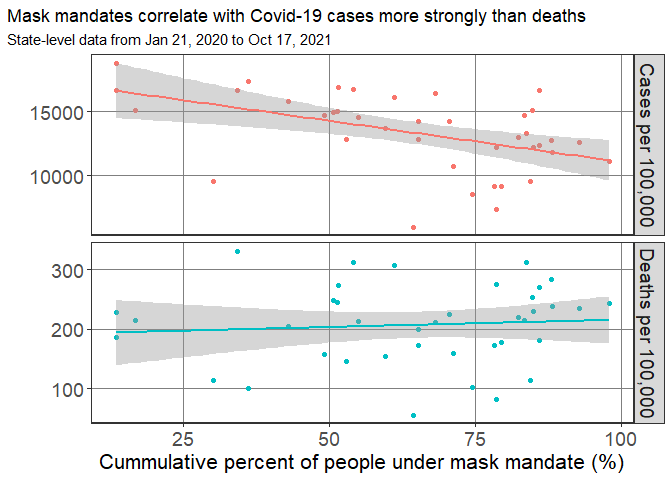
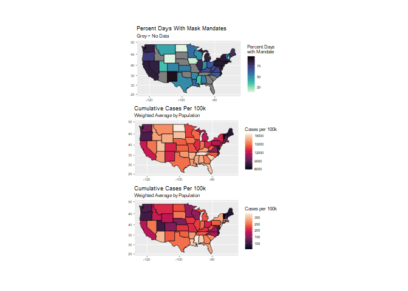

Team Report
================
Sam Coleman, Ian Eykamp, Carlos Godinez, Evelyn Kessler, Isabel Serrato
10/19/2021

-   [Background](#background)
-   [Dataset Used](#dataset-used)
-   [Team Question](#team-question)
-   [Our Graph](#our-graph)
-   [Observations](#observations)
-   [Interactive Map](#interactive-map)
-   [Future Exploration](#future-exploration)
-   [Notes](#notes)

## Background

In late 2019 a novel coronavirus quickly spread throughout the global
population causing a pandemic that is still causing massive disruptions
in late 2021. SARS-CoV-2, the virus that causes COVID-19, is a highly
contagious respiratory virus. In response to the rapidly spreading
disease and it’s even more infectious variants, local governments and
counties throughout the pandemic have instituted face covering and mask
mandates to slow the spread. While specifics change from location to
location, a mask mandate largely requires individuals to cover their
face and noses when in a public setting. The intent behind this is to
reduce the viral load that a potentially infectious person could spread
to others \[1\]. Masks have been found to be effective in slowing the
spread of COVID-19 and are recommended to be worn by the CDC when in
geographical areas of high spread \[2\].

## Dataset Used

For this challenge, we used two datasets provided in the Covid
challenge, the [population data from the US
census](https://data.census.gov/cedsci/table?t=Population%20Total&g=0100000US%240500000&tid=DECENNIALPL2020.P1),
as well as Covid cases and deaths by county over time taken from a
[dataset collected by the New York
Times](https://raw.githubusercontent.com/nytimes/covid-19-data/master/us-counties.csv).
The population data is from the US Census Bureau and is collected from
the American Community Survey (ACS) Total Population by County 5 year
estimate. An important note about this data: “Estimates of urban and
rural populations, housing units, and characteristics reflect boundaries
of urban areas defined based on Census 2010 data. As a result, data for
urban and rural areas from the ACS do not necessarily reflect the
results of ongoing urbanization.” We did not look into how our results
would change if there was a higher population in urban areas, however,
it would be interesting to re-do our analysis once the most recent 2020
census data is released and see if there are any significant changes.
While the population data is the most accurate data we can obtain
currently, it isn’t perfect and is a bit out of date, both of which are
limiting factors of this dataset. The COVID-19 data is obtained from the
New York times and includes cumulative cases and deaths over time for
each county from January 21, 2020 to October 17, 2021. The dataset
obtains the time series data “from state and local governments and
health departments in an attempt to provide a complete record of the
ongoing outbreak.” The documentation for the table provides an important
note about potential limitations: “Since the first reported coronavirus
case in Washington State on Jan. 21, 2020, The Times has tracked cases
of coronavirus in real time as they were identified after testing.
Because of the widespread shortage of testing, however, the data is
necessarily limited in the picture it presents of the outbreak.” We were
not concerned about this limitation, as this is a problem every dataset
about COVID-19 will encounter since not everyone who has had COVID-19
has received a test for a variety of reasons.

We are using a [Mask Mandate CDC
database](https://data.cdc.gov/Policy-Surveillance/U-S-State-and-Territorial-Public-Mask-Mandates-Fro/62d6-pm5i)
to determine whether or not a mask mandate was in place in every county
for every day from April 10, 2020 through August 15, 2021. These data
are “derived from publicly available state and territorial executive
orders, administrative orders, resolutions, and proclamations (”orders“)
for COVID-19 that expressly require individuals to wear masks in public
found by the CDC, COVID-19 Community Intervention & Critical Populations
Task Force, Monitoring & Evaluation Team, Mitigation Policy Analysis
Unit, Center for State, Tribal, Local, and Territorial Support, Public
Health Law Program, and Max Gakh, Assistant Professor, School of Public
Health, University of Nevada, Las Vegas.” Two other important notes are
that “any orders not available through publicly accessible websites are
not included in these data” and that “These data do not include data on
counties that have opted out of their state mask mandate pursuant to
state law.” Therefore, for each date, every county either has a “Yes”
(there was a mask mandate in place), “No” (there was not a mask mandate
in place), or NA (it is unknown whether or not there was a mask mandate
in place).

We identified two main limitations of this data set. The first is the
amount of NAs in the dataset, and the difficulty this presented in
knowing how to best complete our analysis with the lack of complete
data. If the data was not publicly accessible by the entities mentioned
above, an NA was placed in the mask mandate column. As a quick check,
some members of our team looked at their home counties and saw NAs
during times they knew there was a mask mandate in place, such as
counties in California. There are other states, such as Florida, where
there are only NAs for every county through the entire dataset. We still
chose to analyze this dataset as after conducting further research, it
is the most complete mask mandate dataset that was available. It is
difficult to have a perfect dataset with information about mask mandates
without having central database for which counties individually report
to. In our analysis, for counties where there was at least one day with
a yes/no mask mandate, we treat the NAs as “No” values.

The second limitation of the dataset is that a mask mandate does not
necessarily equal compliance. We thought about different ways we could
take this into account and looked at a dataset of self-reported
mask-wearing survey. We decided not to pursue incorporating this dataset
into our analysis as it only covered July 2 to July 14, 2020, a
relatively early stage in the pandemic. We did not attempt to minimize
this limitation in our analysis, but it is important to consider that
mandate does not necessarily equal people wearing masks, or wearing
masks correctly.

## Team Question

During our exploratory data analysis (EDA) we looked into normalized
cases and deaths vs. self-reported mask wearing, mask mandate trends
geographically, and the relationship between normalized cases and
whether or not a mask mandate was in place, we arrived at the question:
What is the effect of mask mandates on Covid Case Counts per one hundred
thousand residents?

## Our Graph

``` r
library(tidyverse)
```

    ## -- Attaching packages --------------------------------------- tidyverse 1.3.1 --

    ## v ggplot2 3.3.5     v purrr   0.3.4
    ## v tibble  3.1.4     v dplyr   1.0.7
    ## v tidyr   1.1.3     v stringr 1.4.0
    ## v readr   2.0.1     v forcats 0.5.1

    ## -- Conflicts ------------------------------------------ tidyverse_conflicts() --
    ## x dplyr::filter() masks stats::filter()
    ## x dplyr::lag()    masks stats::lag()

``` r
library(ggiraph)
library(cowplot)
library(tools)
load("data/cases_mandate_new_york_fixed.RData")
load("data/mask_deaths")
```

``` r
us_3 %>%
  distinct(region, .keep_all = TRUE) %>% 
  pivot_longer(
    cols = c(cases_per100k, deaths_per100k),
    names_to = "cases_or_deaths",
    values_to = "per100k"
  ) %>% 
  ggplot(mapping = aes(x = days_with_mandate, y = per100k, color = cases_or_deaths)) +
  geom_point() + 
  geom_smooth(method = "lm") + 
  facet_grid(cases_or_deaths ~ ., scales = "free_y", 
             labeller = as_labeller(c(`cases_per100k` = "Cases per 100,000", `deaths_per100k` = "Deaths per 100,000"))) +
  theme_test() +
  theme(
    legend.position = "none",
    plot.title.position = "plot",
    panel.border = element_rect(fill = NA, size = 1),
    # panel.background = element_rect(fill = "grey90"),
    panel.grid.major = element_line(color = "grey50"),
    axis.text.x = element_text(size = 14),
    axis.title.x = element_text(size = 16),
    axis.text.y = element_text(size = 14),
    axis.title.y = element_text(size = 14),
    strip.text.y = element_text(size = 14),
    
  ) +
  labs(
    x = "Cummulative percent of people under mask mandate (%)",
    y = "",
    title = "Mask mandates correlate with Covid-19 cases more strongly than deaths",
    subtitle = "State-level data from Jan 21, 2020 to Oct 17, 2021"
  ) 
```

    ## `geom_smooth()` using formula 'y ~ x'

    ## Warning: Removed 20 rows containing non-finite values (stat_smooth).

    ## Warning: Removed 20 rows containing missing values (geom_point).

<!-- -->

## Observations

We found that there is a negative correlation between the average
percentage of days that each county had a mask mandate and the number of
Covid cases per 100,000 residents. At the same time, there is not a
strong correlation between the average percent of days that each county
had a mask mandate and the number of deaths per 100,000 residents.
Therefore, the dataset supports the claim that mask mandates may help to
reduce the number of cases but not the number of deaths from COVID-19.

## Interactive Map

The maps below show the mask mandate percentage, cases per 100 000, and
deaths per 100 000 residents of each of the contiguous states. For the
mask mandate data, the fill aesthetic is a darker color where mask
mandates were imposed for longer. For the cases and deaths per 100 000,
it is a darker color where cases and deaths are lower. In states where
the correlation between cases and mask mandates holds, the shade of the
fill aesthetic will vary in tandem; and in states that do not follow the
correlation, one map will be substantially darker or lighter than the
other.

``` r
load("C:/dev/git/covid-project/data/mask_map_data.RData")

girafe(
  ggobj = plot_grid(mask_map, case_map, death_map, ncol = 1),
  width_svg = 12, 
  height_svg = 8
)
```

<!-- -->

Some geographic trends can be seen in the map data, including

## Future Exploration

We would be curious to explore the amount of lag that occurs between
when a mandate is put in place and when the rate of increase in cases
per day begins decreasing. In other words, quantitatively finding how
long it takes for a mask mandate to become effective for curbing the
increase in COVID cases in a county. Developing an algorithm to do this
would allow us to explore whether there is a difference in the lag
depending on any other factors (such as location or politics).

An additional area to explore would be to find a dataset relating
whether or not people in a county actually wore masks while a mandate is
in place. Our group found a New York Times poll from summer of 2020 that
showed how often residents in every county wore masks. However, the
outdated nature of this dataset made it difficult to compare with the
mandate data. It would be interesting to see the relationship between
mask mandates and whether or not residents follow the mandates as it
relates to the number of cases and deaths in those counties.

# Notes

<!-- -------------------------------------------------- -->

\[1\] <https://pubmed.ncbi.nlm.nih.gov/32512240/>

\[2\]
<https://www.cdc.gov/coronavirus/2019-ncov/prevent-getting-sick/cloth-face-cover-guidance.html>
